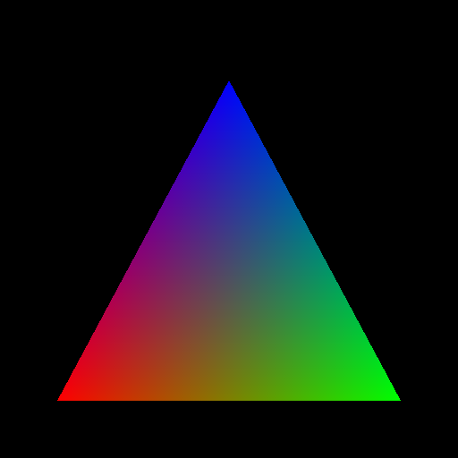
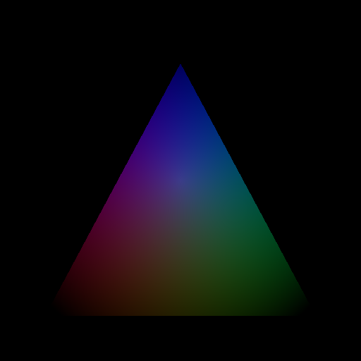

.. py:currentmodule:: moderngl

One familiar triangle
=====================

As with any graphics library guide, we also have a guide on how to draw a triangle.
Below is a slightly modified line drawing code from the :doc:`previous tutorial <../first_rendering/rendering>`. The following code draws one triangle:

.. rubric:: Entire source

.. literalinclude:: triangle_draw.py
    :emphasize-lines: 35-41, 43, 51
    :linenos:

When you run the code you will see this:

    Triangle

As you may have noticed, we only specified three colors for each vertex, but OpenGL interpolates our triangle and we see a soft transition of colors.

At this point you can try out the fragment shader, for example, let's draw a lighting effect:

.. rubric:: Fragment shader

.. literalinclude:: lighted.frag.glsl
    :language: glsl
    :emphasize-lines: 8-9

    Lighted triangle
    
Shaders are not very fond of branching algorithms and operations such as ``if (condition) {action} else {action}``. It is recommended to use formulas more often.

