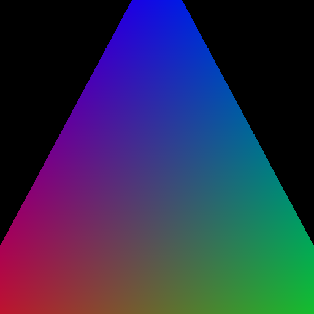
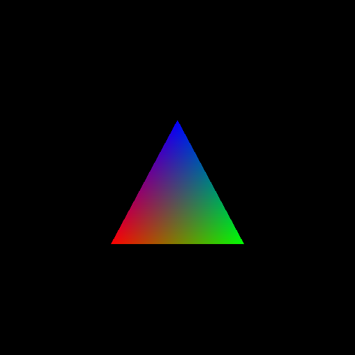

.. py:currentmodule:: moderngl

Uniform
=======

At some point you will need to make a lot of small changes to your rendering. Changing the screen aspect ratio, viewing angle, changing perspective/orthographic projection and much more. And in many situations it will be very convenient to use :py:class:`Uniform` -s.

:py:class:`Uniform` -s can be specified and used at any time during rendering. They allow you to replace all constants in the shader with variables and change them as needed. The :py:class:`Uniform` is initialized in the shader as follows::

    uniform float var1;

Changing the :py:class:`Uniform` -s value in ModernGL is very easy. For example, setting the value for our variable ``140.02`` is done as follows::

    vao.program['var1'].value = 140.02
    
    # or (using `__setitem__` shortcut)
    vao.program['var1'] = 140.02

If the variable type is not ``float``, but ``vec4``, simply list the values separated by commas::

    vao.program['var2'] = 1, 2, 3, 4
    # or
    vao.program['var2'] = [1, 2, 3, 4]
    # or
    vao.program['var2'] = (1, 2, 3, 4)

You need to list as many values as the :doc:`value type <../low_start/shader_basics>` takes: ``float`` will take 1 number, ``vec2`` will take 2 numbers, ``vec4`` will take 4 numbers, ``mat4`` will take 16 numbers, etc.

Let's consider a case where we need to change the size of our triangle. Take the :doc:`original triangle drawing code <../triangles_draw/one_familiar_triangle>` and make the following changes.

To change the scale (size) of the triangle, add a ``scale`` :py:class:`Uniform`. In the vertex shader it will be multiplied by all vertices and thus allow us to control the size of all triangles.

.. rubric:: Entire source
.. literalinclude:: triangle_draw_uniform.py
    :emphasize-lines: 15, 21, 54
    :linenos:

We set the scale value to ``2.0``, which means our triangle will be enlarged by 2 times.

    Enlarged triangle

Now let's set the scale value to ``0.5`` to reduce the triangle by 2 times::

    vao.program['scale'] = 0.5

    Reduced triangle

Uniforms can not only be set, but also read. This is done as follows::

    scale = vao.program['scale'].value

Also Uniforms can be written or read directly, in the form of bytes::

    # write
    scale = 2
    b_scale = numpy.asarray([scale], dtype='f4').tobytes()
    vao.program['scale'].write(b_scale)

    # read
    b_scale = vao.program['scale'].read()
    scale = numpy.frombuffer(b_scale, dtype='f4')[0]

    # `numpy.frombuffer()` converts a byte string into an array,
    # since we have one number, we select it from the array.

In most cases, directly using :py:class:`Uniform` -s ``.read()/.write()`` methods can speed up the code, but constantly manually converting variables into bytes does not make sense, since ModernGL already does it in the most optimized way.
